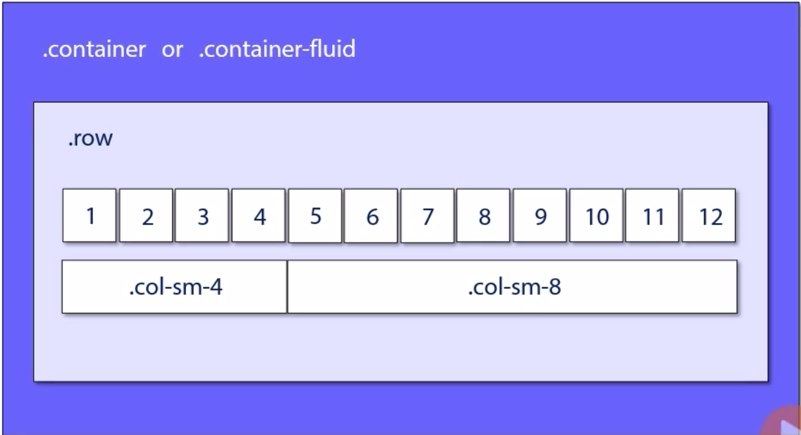
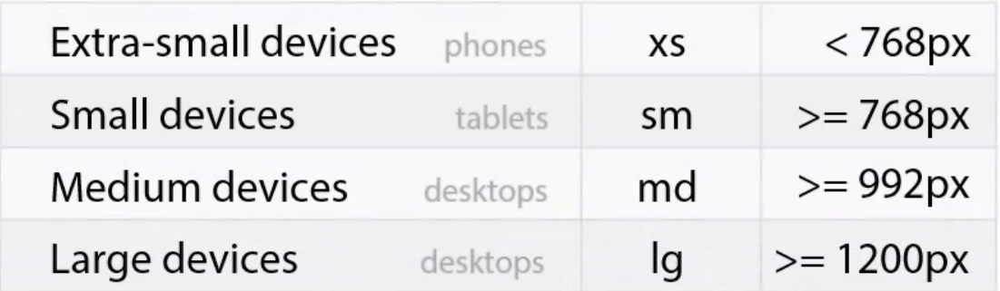
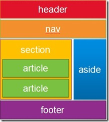
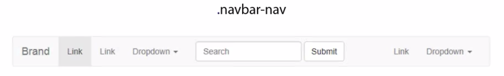
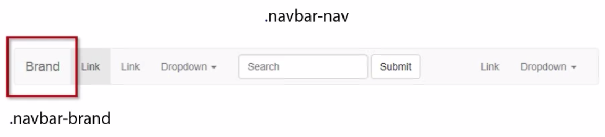
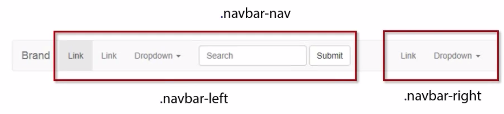
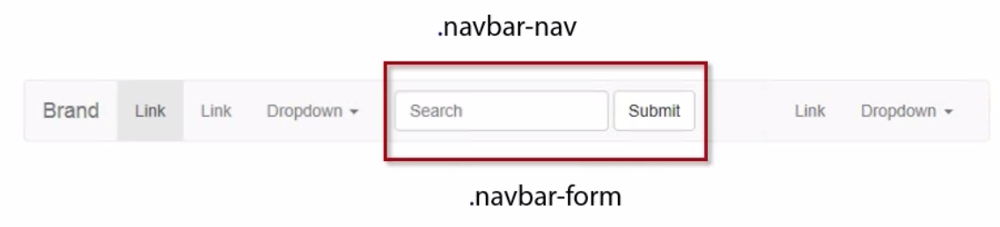
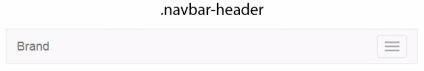
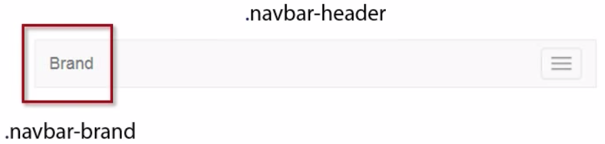
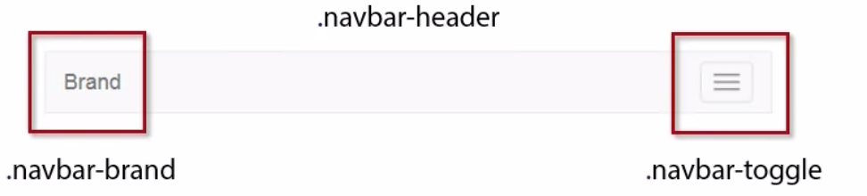

# Bootstrap

## Responsive Patterns Using Bootstrap

### Bootstrap´s Grid and Visual Breakpoints

Firstable everything needs to happen within a container

- `.container`: has a fixed-with container

- `.container-fluid`: for a full width container, spanning the entire width of the viewport.

More information [here](https://getbootstrap.com/docs/4.3/layout/overview/#containers)

Inside of an container we have need the class of `.row` and of course you can have several per container and the `.row` can have **12 column grid**, example:

```html
.col-sm-4 .col-sm-8
```

So `4+8` = 12





### Google Fonts

You can use google fonts from the official website

[Google fonts](https://fonts.google.com)

### Setting Up a Multi-Column Page

In the following example there will be a `container` with one `row` and 3 `columns`

```html
<div class="container">
  <div class="row">
    <aside class="col-sm-2">
      Column 1
    </aside>
    <section class="col-sm-8">
      Column 2
    </section>
    <aside class="col-sm-2">
      Column 3
    </aside>
  </div>
</div>
```

The following image explains how the mentioned tags works:



## Responsive Navigation

### Bootstrap´s Navbar Classes

#### `.navbar-nav`

The skeleton of a `.navbar-nav` is the following:

1.  The full wide `Navbar` can be styled with



2. The `Brand` to the far left side can be styled with



3. And after the `brand` the `.navbar-nav` is spliited in left and right side



4. The search form from the middle can be styled with:



#### `.navbar-header`

The skeleton of a `.navbar-header` is the following:

1. The full wide `.navbar-header` can be styled with



2. The `Brand` to the far left side cab be styled with



3. The button on the far right side can be styled with



### Animating the `Navbar` When Scroll Down

1. `css` configuration

```css
.navbar{
  padding: 80px;
}
.cbp-af-header-shrink{
  padding-top: 5px;
  padding-bottom: 5px;
}
```

To make it big the `navbar` at starts and to make it small when scroll down

2. Third party library

[Full Animated Library](https://github.com/codrops/AnimatedHeader) (only for reference)

Download the following scripts

- [cassie.js](https://raw.githubusercontent.com/codrops/AnimatedHeader/master/js/classie.js)
- [cbpAnimatedHeader.js](https://raw.githubusercontent.com/codrops/AnimatedHeader/master/js/cbpAnimatedHeader.js)

Put these scripts at the end of the `body` tag, because the script `cbpAnimatedHeader.js` needs to be able to see the complete DOM in order to see the `cbp-af-header` class element

> `classie.js` script first

```html
<head>
  <!-- Animated Header -->
  <script src="cassie.js"></script>
  <script src="cbpAnimatedHeader"></script>
```

3. Add `fixed-top` & `cbp-af-header` to `nav  ` tag as a classes, [example here](https://getbootstrap.com/docs/4.3/components/navbar/#placement)

4. Add transition effect

in the `css` file add the following propierties to `.navbar` class

```css
-webkit-transition: all 0.3s;
transition: all 0.3s;
```

and this properties to `.cbp-af-header-shrink` class

```css
opacity: 0.7;
```

## Responsive Images and Videos

### Responsive Images in Bootstrap

To make an image responsive (**fixing height and weight when on window resize**) take a look to the official [documentation](https://getbootstrap.com/docs/4.3/content/images/#responsive-images)


